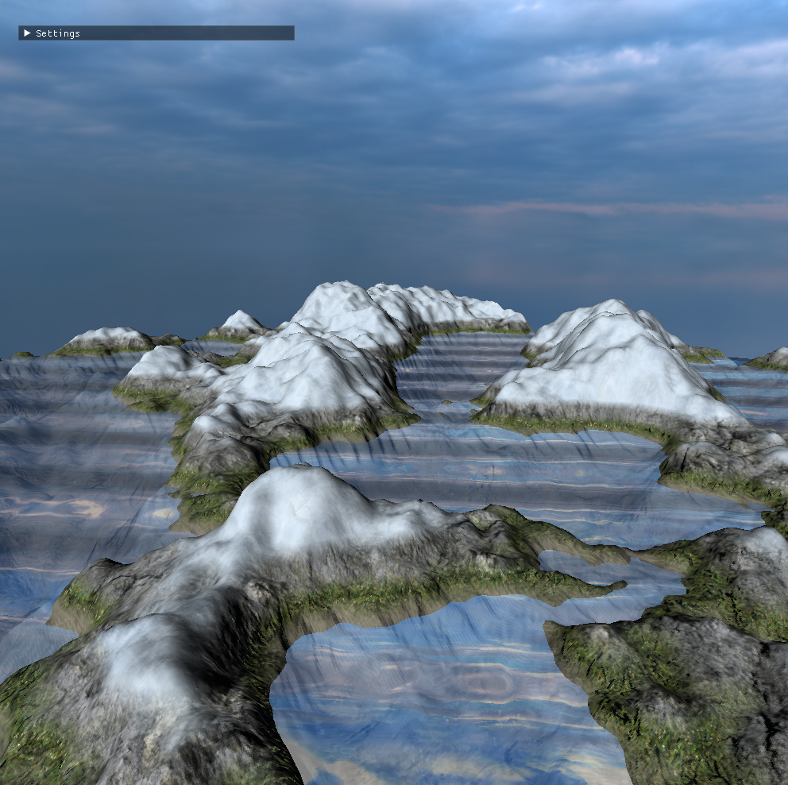
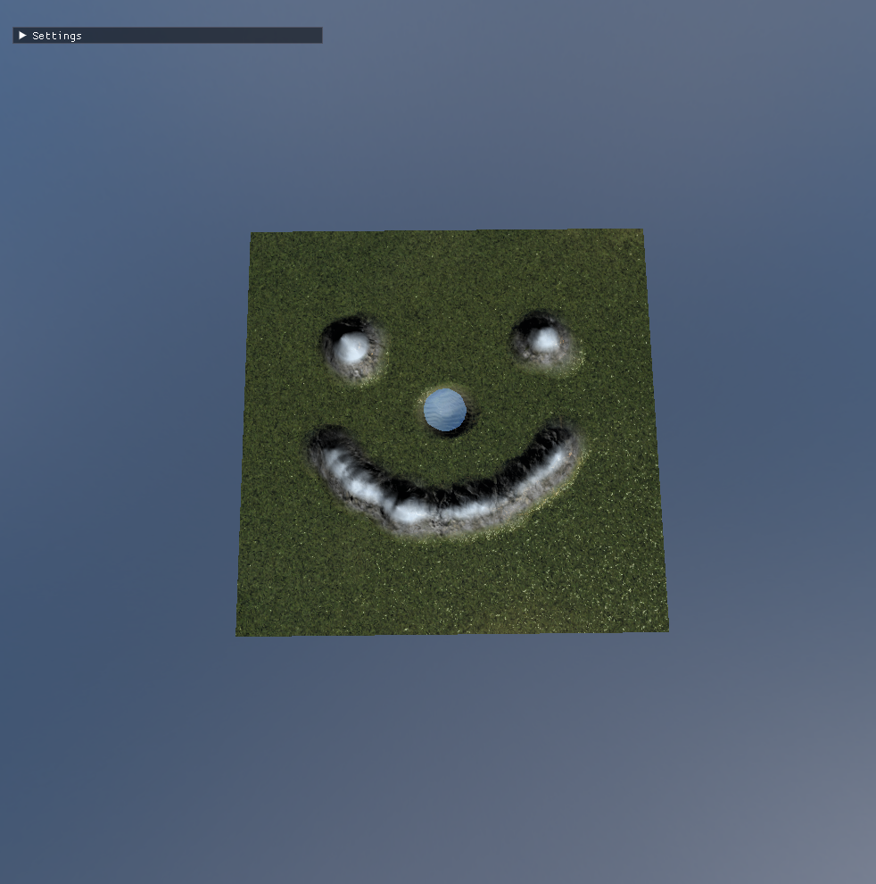

# Terrain Generation and Raycasting
|Generation Example|Drawing Example|
|-|-|
||

## Justification
Terrain Generation is used in many games and makes use of random noise, it allows for infinite generation of landscapes without needing to make worlds yourself. This type of generation can also be used to randomly place structures, biomes, water, caves, and anything else no one will *probably* stop you.

Terrain Generation is used in many big games like Minecraft, Terraria, Astroneer, Deep Rock Galactic, Factorio, and a lot more.

Raycasting is used in many big games and films that use anything 3d. Some examples are Minecraft, Pixar, Skyrim, Mario Odyssey, and anything that wants to check for collision faster. 

## Prior Knowledge
Things you should know:
- Terrain Generation uses different types of noise but the one we used was Perlin Noise.
    - The value of the perlin noise determines the height of the terrain: Dark = low, Bright = high.
    - Perlin Noise is calculated with multiple values: Frequency, Octaves, Amplitude and Persistence
    - Vectors, dot product, lerp as these are all used in perlin generation
- Raycasting uses various mathematical knowledge:
    - 3D coordinates, needed for working in a 3d space.
    - Vectors, which are used to calculate the ray.
- Additionally, 3D Collision uses a complicated mathematical formula that requires some knowledge of:
    - 3D Shapes, Vertices, and Edges, for calculating if a ray collides.
    - Vector Math, specifically the dot and cross products.
    - Planar math, in order to calculate the intersection.

## Steps through Terrain Generation
### Step 1 - Generate The Noise
1. Split the input coordinates into cell coordinates and offset coordinates.
2. Create hash values of the cell coordinates 
3. Use the hash values to create a gradient-dot value returning different values
4. Calculate the fade weight using Perlin’s fade function
Then linearly interpolated the corners along the x and then the y.

### Step 2 - Use the Perlin Noise
1. The perlin noise function now allows us to get the noise value at any given point so we can generate data for a texture that can be passed into the terrain shader.
2. This is done like texture generation but generating the data with the noise function.
3. With the texture and data we can generate the terrain vertices, and calculate normals.
4. Giving us a generated Terrain Mesh with normals and actual height!

### Step 3 - COLORS!
The height texture can be passed into the fragment shader which allows for separate colors to be used for different heights.

And going further the colors can be replaced with textures and smoothed out using the distance from the threshold.

## Steps through Raycasting and Collision detection
### Step 1 - Make the Ray!
Making the Ray is the easiest part of the process:
1. Initially, normalize the given mouse coordinates based on the screen size and make the initial ray.
2. We then make a ray in the near plane (the -1 z coordinate) so the ray faces forward from the camera.
3. We then invert the camera coordinates so we are now in the local camera coordinates, where we manually set the Z and W again.
4. We then convert the local camera coordinates to the world space coordinates and return the normalized ray.

### Step 2 - Check for Intersection
We then have a function for the collision function, which checks if the ray intersects a given triangle using the Möller-Trumbore algorithm:
1. First, we calculate the relevant edges of the triangle.
2. We next get the determinant, which lets us check if the ray is perfectly parallel to the triangle’s plane.
3. We then get the barycentric coordinates of the intersection point on the plane of the triangle. If the coordinate is outside of 0-1, then the ray does not intersect on one of the axis.
4. Finally, we make sure the plane isn’t behind the camera by checking the distance between the camera and the triangle, then we return if there was an intersection.

### Step 3 - Collision Detection
Finally, we have the actual collision function:
1. We set up some necessary variables, including the ray’s direction and origin, and get all the vertices and indices.
2. We then start to loop through all of the triangles of the terrain, getting each of the vertices of each triangle.
3. We then check if the ray actually hits the triangle using the previous function.
4. We then get the exact vertex that was closest to being hit based on the distance and return it. Otherwise, we send a number that will never be hit to indicate there was no collision.

The code is returned into main.cpp, where it calls a function to adjust the perlin noise, and therefore creating a sandbox terrain growth/shrink effect.
*(There is some leftover code from when I was going to try and optimize and check multiple triangles; I did not have the time to finish that)*

## Efficiency Issues
At high resolution the Terrain generation can become slow when drawing and loading all the vertices. This means a bit of lag when reloading or modifying the mesh, making drawing and loading slow. A solution could be to move some of the calculations to the vertex shader instead of calculating it on the CPU like normals and height, as well as loading less resolution and vertices, interpolating inbetween.

For the Raycasting and Collision, the program tends to lag when clicking on terrain with more subdivisions, as it must iterate through all of them and check if each part has a collision on it. This could likely be cut down with optimization techniques that only check a certain area of impact, but it was out of scope before the due date.

## Optimization Techniques
One optimization the Terrain Generation needed was the texture generation. I started with generating a noise texture and a color that was used for height and texturing. However this was generating an 8k image which took a bit to render so I moved the texture and color calculation over from the CPU to the fragment shader on the GPU, which worked and was about 100x faster.

One optimization the Collision Detection uses is cutting the loop early if a single intersection is found by saving the distance calculation. While this seems like an obvious step to take, the algorithm I used would check each triangle it hit and keep going to see if there was a triangle closer, not taking into account the already calculated distance from a previous function.